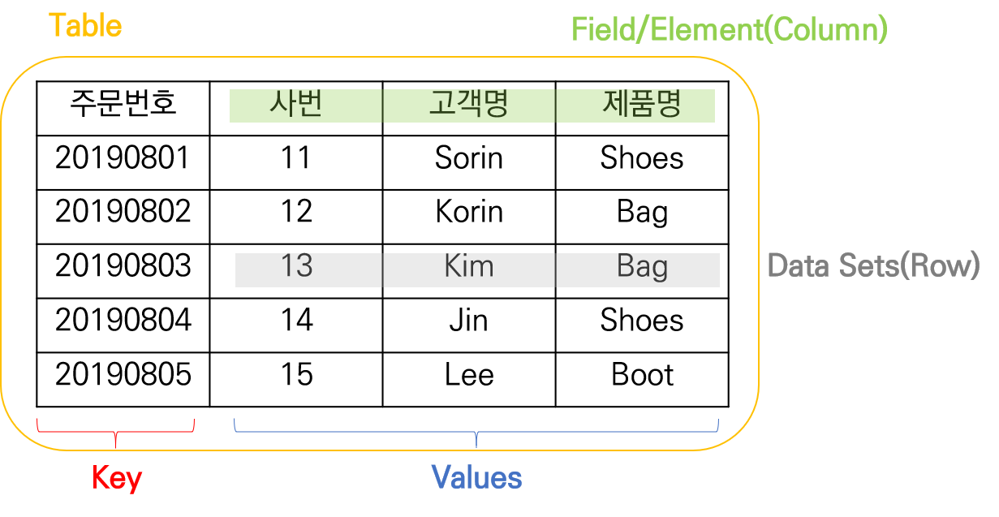
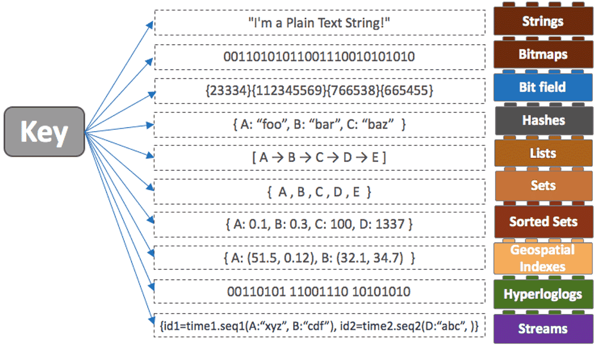
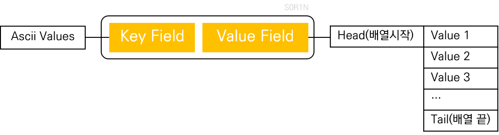
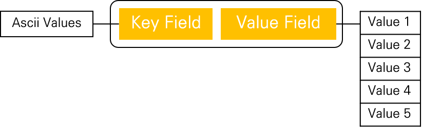
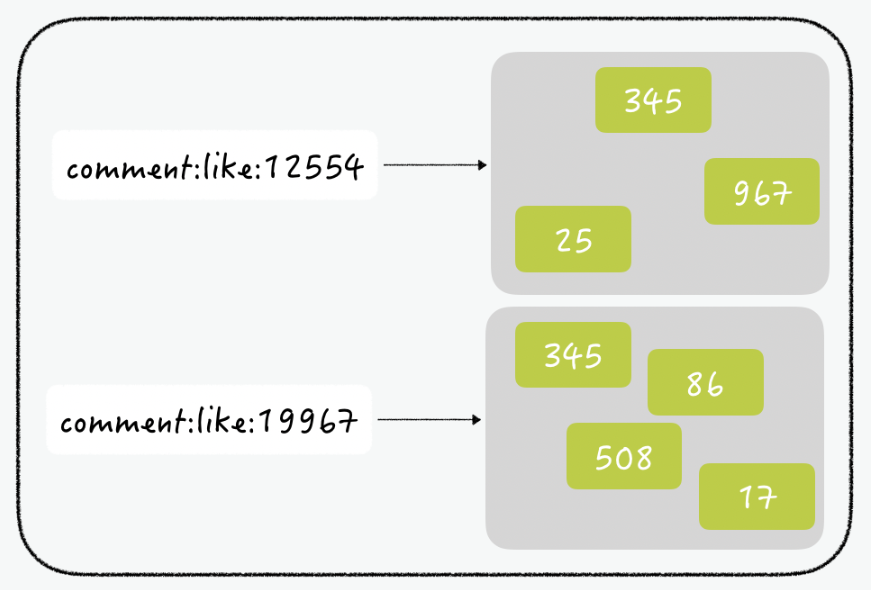

# 02. Redis 설치 및 데이터 처리

키벨류 데이터스토어의 대포적인 제품 중 하나인 Redis는 Remote Directory System의 약어로 Vmware.co가 스폰서였으며 지금은 RedisLab co.에 의해 상용 라이선스가 개발되어 지원되고 있습니다.


## 2.1 주요 특징

### 주요 특징

1. In Memory
   - 대표적인 In Memory 기반의 데이터 처리 및 저장기술을 제공하기 때문에 다른 NoSQL 제품에 비해 상대적으로 빠른 Read/Write가 가능
2. Multi Data Types
   - String
   - Set
   - Sorted Set
   - Hash
   - List
   - Bitmap
   - HyperLogLogs
   - Streams
   - Geospatial
3. On Disk Consistency
   - Dump 파일과 AOF 방식으로 메모리 상의 데이터를 디스크에 저장
4. Replication
   - Master/Slave 복제를 통해 데이터 분산, 복제 기능을 제공하며, Query Off Loading을 통해 Master는 Read/Write를 Slave는 Read만 수행 가능
5. Clustering
   - 파티셔닝을 통해 동적 스케일 아웃인 수평 확장이 가능
6. Expriation 
   - 메모리 상의 데이터를 자동 삭제하도록 시간을 지정


### 업무 영역

- 날아갈 수 있는 메모리 기반이기 때문에 세컨더리 DB로 사용되는 것이 보편적
- 데이터 캐싱 서버
- 메시지큐, 머신러닝, 어플리케이션 잡 매니징, 검색 엔진에서도 쓰인다.


## 2.5 데이터 처리

### 2.5.1 용어 설명



- **Table** 하나의 DB에서 데이터를 저장하는 논리적 구조로 관계형 DB에서 표현하는 논리적 개념인 테이블과 동일합니다.
- **Data sets** 테이블을 구성하는 논리적 단위입니다. 하나의 data-sets은 하나의 key와 한 개 이상의 field/element로 구성됩니다.
- **Key** 하나의 key는 하나 이상의 조합된 값으로 표현 가능합니다.
- **Values** 해당 key에 대한 구체적은 데이터 값을 표현합니다. value는 하나 이상의 field 또는 element로 구성됩니다.


### 2.5.2 데이터 입력/수정/삭제/조회

Redis DB 에 데이터를 입력, 수정, 삭제, 조회하기 위해서는 반드시 Redis 서버에서 제공하는 명령어를 사용해야합니다.


### 2.5.3 데이터 타입




#### String

**사용처**

1. **세션 캐시:** 많은 웹사이트에서 Redis 문자열을 활용하여 HTML 조각 또는 페이지를 캐시함으로써 웹사이트 경험 속도를 높이는 [세션 캐시](https://redis.io/topics/data-types-intro) 를 생성 합니다. 데이터는 RAM에 임시로 저장되기 때문에 이 속성은 Redis를 세션 캐시로 완벽한 선택으로 만듭니다. 예를 들어 온라인 상점의 장바구니에 저장된 항목과 같은 사용자별 데이터를 임시로 저장할 수 있습니다. 이는 사용자가 로그아웃하거나 연결이 끊어지는 경우 데이터를 잃지 않도록 하는게 중요합니다.


#### [Hash](http://redisgate.kr/redis/command/hashes.php)


- Field와 value로 구성
  - Hashes는 key 하나에 여러개의 field와 value로 구성됩니다. key 하나에 field와 value 쌍을 40억개(4,294,967,295)까지 저장 가능합니다.

- Table과 Hash의 유사한 점

  - Hashes가 field와 value로 구성된다는 면에서 RDB의 table과 비슷합니다. Hash key는 table의 PK, field는 column, value는 value로 보면 됩니다. Key가 PK와 같은 역할을 하기 때문에 key 하나는 table의 한 row와 같습니다.

- Table과 Hash의 다른 점

  - Table의 column 수는 일반적으로 제한이 있는 반면, Hash의 field 수는 40억개로 거의 무제한에 가깝습니다. Table에서 column을 추가하려면 alter문으로 미리 table을 변경해야 하나, Hash에서는 그런 사전 작업이 필요없습니다. 따라서 field의 추가/삭제는 자유롭습니다. Field의 추가/삭제는 해당 key에만 영향을 미칩니다.

  

**명령어 요약**

- **SET**: HSET, HMSET, HSETNX

- **GET**: HGET, HMGET, HLEN, HKEYS, HVALS, HGETALL, HSTRLEN, HSCAN, HEXISTS

- **REM**: HDEL

- **INCR**: HINCRBY, HINCRBYFLOAT

  

**사용처**

1. **사용자 프로필:** 많은 웹 애플리케이션은 이름, 성, 이메일, 비밀번호 등과 같은 모든 사용자 필드에 단일 해시를 사용할 수 있기 때문에 사용자 프로필에 Redis 해시를 사용합니다.
2. **사용자 게시물:** [Instagram](https://instagram-engineering.com/storing-hundreds-of-millions-of-simple-key-value-pairs-in-redis-1091ae80f74c) 과 같은 소셜 플랫폼  은 Redis 해시를 활용하여 보관된 모든 사용자 사진이나 게시물을 다시 단일 사용자에게 매핑합니다. 해싱 메커니즘을 통해 매우 빠르게 값을 조회 및 반환하고, 데이터를 메모리에 맞추고, 서버 중 하나가 중단된 경우 데이터 지속성을 활용할 수 있습니다.


**실습**

```bash
# Hash 타입은 하나의 Key에 여러 개의 field와 value를 저장할 수 있음
redis> hmset order:20211113 customer_name "Woman & Sports" emp_name "Magee" total 601100 pament_type "Credit" order_filled "Y" ship_date 20210525
OK

# order:20211113 키에 대한 customer 필드 값 검색
redis> hget order:20211113 customer_name
Woman & Sports
redis> hget order:20211113 ship_date
20210525

# order:20211113 키에 대한 모든 필드와 값 검색
redis> hgetall order:20211113
customer_name Woman & Sports
emp_name Magee
total 601100
pament_type Credit
order_filled Y
ship_date 20210525

# field 존재 여부 확인 (0:미존재, 1:존재)
redis> hexists order:20211113 product_name
0
redis> hexists order:20211113 customer_name
1

# ship_date 필드 제거
redis> hdel order:20211113 ship_date
1

# ship_date 필드 제거 확인
redis> hgetall order:20211113
customer_name Woman & Sports
emp_name Magee
total 601100
pament_type Credit
order_filled Y

# ship_date 필드 다시 추가
redis> hmset order:20211113 ship_date 20210525
OK

# ship_date 필드 추가 확인
redis> hgetall order:20211113
customer_name Woman & Sports
emp_name Magee
total 601100
pament_type Credit
order_filled Y
ship_date 20210525

# order:20211113 키에 대한 필드 목록 조회
redis> hkeys order:20211113
0 customer_name
1 emp_name
2 total
3 pament_type
4 order_filled
5 ship_date

# order:20211113 키에 대한 값 목록 조회
redis> hvals order:20211113
0 Woman & Sports
1 Magee
2 601100
3 Credit
4 Y
5 20210525

# order:20211113 키에 대한 필드 개수 출력
redis> hlen order:20211113
6

# order:20211113 특정 필드 조회
redis> hmget order:20211113 emp_name total
0 Magee
1 601100
```


#### [List](http://redisgate.kr/redis/command/lists.php)



- Lists는 key와 value가 **일 대 다** 관계입니다.
- value는 입력된 순서대로 저장됩니다.
- Lists는 주로 큐(Queue)와 스택(Stack)으로 사용됩니다.
- [큐(Queue)](http://redisgate.kr/redis/command/queue_ani.php)는 들어오는 데이터를 순서대로 처리할때 사용합니다.
- [스택(Stack)](http://redisgate.kr/redis/command/stack_ani.php)은 웹브라우져의 백버튼 처럼 주로 되돌아 갈때 사용합니다.


**명령어 요약**

- **SET (PUSH)**: LPUSH, RPUSH, LPUSHX, RPUSHX, LSET, LINSERT, RPOPLPUSH
- **GET**: LRANGE, LINDEX, LLEN
- **POP**: LPOP, RPOP, BLPOP, BRPOP
- **REM**: LREM, LTRIM
- **BLOCK**: BLPOP, BRPOP, BRPOPLPUSH


**사용처**

1. **소셜 네트워킹 사이트:** Twitter와 같은 소셜 플랫폼은 Redis 목록을 사용하여 타임라인 또는 홈페이지 피드를 채우고 트렌드 트윗이나 스토리로 피드 상단을 사용자 지정할 수 있습니다.
2. **RSS 피드:** 최신 업데이트를 가져오고 관심 있는 팔로워가 RSS 피드를 구독하도록 허용할 수 있는 사용자 지정 소스에서 뉴스 피드를 만듭니다.


**실습**

```bash

# List 타입은 하나의 키에 여러 개의 값을 저장 할 수 있음, 키가 없는 경우 생성
redis> lpush quick_starters:members "HyuckJin" "JongMin" "SuHwan"
3

# 0(시작 인덱스)부터 10(끝 인덱스) 까지 범위 조회
redis> lrange quick_starters:members 0 10
0 SuHwan
1 JongMin
2 HyuckJin

# List Right Push 연산 (마지막에 데이터 추가)
redis> rpush quick_starters:members "SeokYeol" "JaeMyung"
5
redis> lrange quick_starters:members 0 10
0 SuHwan
1 JongMin
2 HyuckJin
3 SeokYeol
4 JaeMyung

# List Pop 연산 (마지막에서 하나의 요소 제거)
redis> rpop quick_starters:members
JaeMyung
redis> lrange quick_starters:members 0 10
0 SuHwan
1 JongMin
2 HyuckJin
3 SeokYeol

# 리스트 길이 조회
redis> llen quick_starters:members
4

# 인덱스 조회
redis> lindex quick_starters:members 0
SuHwan
redis> lindex quick_starters:members 1
JongMin
redis> lindex quick_starters:members 2
HyuckJin

# 특정 인덱스 값 변경
redis> lset quick_starters:members 0 "JunPyo"
OK
redis> lrange quick_starters:members 0 10
0 JunPyo # 
1 JongMin
2 HyuckJin
3 SeokYeol

# 키가 이미 있을 경우에만 리스트의 왼쪽에 데이터를 저장
redis> lpushx quick_starters:members "HyuckJin"
5
redis> lrange quick_starters:members 0 10
0 HyuckJin
1 JunPyo
2 JongMin
3 HyuckJin
4 SeokYeol

# 특정 값 앞에 저장
redis> linsert quick_starters:members before "JongMin" "Lijeong"
6
redis> lrange quick_starters:members 0 10
0 HyuckJin 
1 JunPyo
2 Lijeong
3 JongMin
4 HyuckJin
5 SeokYeol
```


#### **Set**



- Sets는 key와 value가 **일 대 다** 관계입니다.
- Value는 입력된 순서와 상관없이 저장되며, 중복되지 않습니다. 즉, value A가 2번 저장되도 결과적으로 하나만 남습니다.
- Sets에서는 집합이라는 의미에서 value를 member라 부릅니다.
- Sets은 주로 카드게임같은 게임이나, 집합연산이 필요한 곳에 사용됩니다.


**명령어 요약**

- **SET**: SADD, SMOVE
- **GET**: SMEMBERS, SCARD, SRANDMEMBER, SISMEMBER, SSCAN
- **POP**: SPOP
- **REM**: SREM
- **집합연산**: SUNION, SINTER, SDIFF, SUNIONSTORE, SINTERSTORE, SDIFFSTORE

 

**사용처**

1. **전자상거래 판매 분석:** 많은 [온라인 상점에서](https://scalegrid.io/blog/introduction-to-redis-data-structures-sets/) Redis 세트를 사용하여 특정 제품 카테고리 또는 하위 카테고리에 대한 검색 또는 구매와 같은 고객 행동을 분석합니다. 예를 들어, 온라인 서점 주인은 심리학에서 얼마나 많은 고객이 의학 서적을 구입했는지 알 수 있습니다.
2. **IP 주소 추적:** Redis Sets는 특정 웹사이트 페이지나 블로그 게시물을 방문한 모든 IP 주소를 분석하고 고유 방문자의 모든 중복을 무시할 수 있는 SADD 기능을 사용하려는 개발자에게 훌륭한 도구입니다.
3. **부적절한 콘텐츠 필터링:** 사용자 입력을 수집하는 모든 앱의 경우 부적절한 단어에 대한 [콘텐츠 필터링](https://dzone.com/articles/how-to-use-redis-for-content-filtering) 을 구현하는 것이 좋습니다. [필터링](https://dzone.com/articles/how-to-use-redis-for-content-filtering) 하려는 단어를 SET 키와 SADD 명령에 추가하여 Redis 세트로 이를 수행할 수 있습니다.


**실습**

```bash
# 집합에 member를 추가 (예정된 스터디 집합 생성)
redis> SADD study:schedule "HTTP3" "BATCH"
(integer) 2
redis> SADD study:schedule "FLYWAY"
(integer) 1

# 집합 조회
redis> SMEMBERS study:schedule
1) "HTTP3"
2) "FLYWAY"
3) "BATCH"

# 집합에 속한 member의 갯수를 조회
redis> SCARD study:schedule
(integer) 3

# 완료된 스터디 집합 생성
redis> SADD study:complete "KAFKA"
(integer) 1
redis> SMEMBERS study:complete
1) "KAFKA"

# 차집합을 구함 (스케쥴된 스터디 목록을 기준으로)
redis> SDIFF study:schedule study:complete
1) "HTTP3"
2) "FLYWAY"
3) "BATCH"
redis> SDIFF study:complete study:schedule
1) "KAFKA"

# 차집합을 구해서 새로운 집합에 저장
redis> SDIFFSTORE study:diff study:schedule study:compete
(integer) 3
redis> SMEMBERS study:diff
1) "HTTP3"
2) "FLYWAY"
3) "BATCH"

# 합집합을 구함
redis> SUNION study:schedule study:complete
1) "HTTP3"
2) "FLYWAY"
3) "KAFKA"
4) "BATCH"

# 합집합을 구해서 새로운 집합에 저장 (스터디 전체 목록 키에 저장)
redis> SUNIONSTORE studies study:schedule study:complete
(integer) 4
redis> SMEMBERS studies
1) "HTTP3"
2) "FLYWAY"
3) "KAFKA"
4) "BATCH"

# 멤버 추가 삭제
redis> SADD studies "COIN"
(integer) 1
redis> SREM studies "COIN"
(integer) 1
redis> SMEMBERS studies
1) "FLYWAY"
2) "KAFKA"
3) "BATCH"
4) "HTTP3"

# 집합에서 무작위로 member를 가져옴
redis> SPOP studies 1
1) "HTTP3"
redis> SMEMBERS studies
1) "FLYWAY"
2) "BATCH"
3) "KAFKA"
```


**사례 - 좋아요 처리하기**



좋아요 처리에서 가장 중요한 것은 한 사용자가 하나의 댓글에 좋아요를 한번씩만 할수 있다는 것입니다. RDBMS에서 유니크 조건을 걸어서 구현할 수 있지만, 이렇게 insert와 update가 자주 발생하는 경우 RDBMS 성능 저하가 필연적으로 발생하게 됩니다. 

**레디스의 Set**을 이용하면 간단하게 구현할 수 있으며, 빠른 시간 안에 처리할 수 있습니다. 댓글의 번호를 key로 하고, 해당 댓글에 좋아요를 누른 회원 ID를 아이템으로 추가하면 위의 조건을 만족할 수 있습니다. (제디스를 이용하여 구현을 하면 초당 약 16만건의 커맨드를 처리할 수 있다고 합니다.)

```bash
redis> SADD comment:like:12554 25 345 967
(integer) 3

redis> SMEMBERS comment:like:12554
1) "25"
2) "345"
3) "967"

redis> SADD comment:like:12554 25
(integer) 0

redis> SMEMBERS comment:like:12554
1) "25"
2) "345"
3) "967"
```


#### [Sorted Set](http://redisgate.kr/redis/command/zsets.php)

- Sorted Sets는 key 하나에 여러개의 score와 value로 구성됩니다.
- Value는 score로 sort되며 중복되지 않습니다.
- score가 같으면 value로 sort됩니다.
- Sorted Sets에서는 집합이라는 의미에서 value를 member라 부릅니다.
- Sorted Sets은 주로 sort가 필요한 곳에 사용됩니다.


**명령어 요약**

- **SET**: ZADD
- **GET**: ZRANGE, ZRANGEBYSCORE, ZRANGEBYLEX, ZREVRANGE, ZREVRANGEBYSCORE, ZREVRANGEBYLEX, ZRANK, ZREVRANK, ZSCORE, ZCARD, ZCOUNT, ZLEXCOUNT, ZSCAN
- **POP**: ZPOPMIN, ZPOPMAX
- **REM**: ZREM, ZREMRANGEBYRANK, ZREMRANGEBYSCORE, ZREMRANGEBYLEX
- **INCR**: ZINCRBY
- **집합연산**: ZUNIONSTORE, ZINTERSTORE


**사용처**

1. **Q&A 플랫폼:** [Stack Overflow](https://redis.io/topics/whos-using-redis) 및 Quora와 같은 많은 Q&A 플랫폼은 Redis Sorted Sets를 사용하여 제안된 각 질문에 대해 가장 높은 투표를 받은 답변의 순위를 지정하여 최고 품질의 콘텐츠가 페이지 상단에 나열되도록 합니다.
2. **게임 앱 스코어보드:** [온라인 게임 앱](https://www.ionos.com/community/hosting/redis/how-to-implement-a-simple-redis-leaderboard/) 은 Redis Sorted Sets를 활용하여 높은 점수 목록을 유지합니다. 점수는 반복될 수 있지만 고유한 사용자 세부 정보가 포함된 문자열은 그렇게 할 수 없기 때문입니다.
3. **작업 예약 서비스 :** 레디 스 조회 결과 순위 설정은위한 훌륭한 도구입니다 [작업 예약 서비스](https://medium.com/@ApsOps/migrating-redis-sorted-sets-without-losing-data-f9e85f6549c5) 당신이 당신의 대기열에서 작업의 우선 순위를 평가하고 점수를 연결할 수 있습니다로. 점수가 기록되지 않은 작업의 경우 WEIGHTS 옵션을 기본값 1로 사용할 수 있습니다.


**실습**

```bash
# Bulk Insert로 영화 목록 추가
redis> ZADD movie 17615686 "명량" 16266338 "극한직업" 14414658 "신과함께-죄와벌" 14263980 "국제시장" 13977602 "어벤져스: 엔드게임" 13747792 "겨울왕국
 2" 13486963 "아바타" 13414484 "베테랑"
8

# 전체 목록 조회 (score 기반 오름차순)
redis> ZRANGE movie 0 -1
0 베테랑
1 아바타
2 겨울왕국 2
3 어벤져스: 엔드게임
4 국제시장
5 신과함께-죄와벌
6 극한직업
7 명량

# 추가
redis> ZADD movie 34203 "마블 이터널스"
1
redis> ZRANGE movie 0 -1
0 마블 이터널스
1 베테랑
2 아바타
3 겨울왕국 2
4 어벤져스: 엔드게임
5 국제시장
6 신과함께-죄와벌
7 극한직업
8 명량

# 랭킹 조회 (오름차순)
redis> ZRANK movie "아바타"
2

# 개수 조회
redis> ZCARD movie
9

# 스코어 범위 값을 통해 조회 (1000만 이상 영화 조회)
redis> ZCOUNT movie 10000000 20000000
8

# 제거
redis> ZREM movie "마블 이터널스"
1

# 실제론 영화는 내림차순이므로 ZREVRANGE 사용
redis> ZREVRANGE movie 0 -1
0 명량
1 극한직업
2 신과함께-죄와벌
3 국제시장
4 어벤져스: 엔드게임
5 겨울왕국 2
6 아바타
7 베테랑

# 내림차순 랭킹 조회
redis> ZREVRANK movie "베테랑"
7

# 스코어 조회
redis> ZSCORE movie "베테랑"
13414484
```


**사례 - 최근 검색 목록 표시하기**

최근 검색된 내역을 조회하는 것도 레디스로 간단하게 구현이 가능합니다. Dooray와 같은 협업도구에서 최근 검색했던 담당자를 볼 수 있는 기능을 추가한다고 생각해볼까요?

이 기능을 관계형 데이터베이스를 이용해 구현하려면 아래와 비슷한 쿼리문이 필요합니다.

```sql
select * from KEYWORD where ID = 123 order by reg_date desc limit 5;
```

이 쿼리는 사용자가 최근에 검색했던 테이블에서 최근 5개의 데이터를 조회합니다. 하지만 이렇게 RDBMS의 테이블을 이용해서 데이터를 저장한다면 중복 제거도 해야하고, 멤버별로 저장된 데이터의 개수를 확인하고, 오래된 검색어는 삭제하는 작업까지 이루어져야 합니다.

따라서 애초에 중복을 허용하지 않고, 정렬되어 저장되는 레디스의 `sorted set`을 사용하면 간단하게 구현할 수 있습니다. sorted set은 가중치를 기준으로 오름차순으로 정렬되기 때문에, 가중치로 시간을 사용한다면 이 값이 가장 큰, 나중에 입력된 아이템이 맨 마지막 인덱스에 저장됩니다.

.png)

멤버 ID가 123인 사람이 최근 검색한 사람은 위 그림처럼 정렬되어 저장됩니다. 이때 가중치는 입력 순간의 나노세컨드이고, 가장 처음 검색한 사람의 ID는 46, 가장 마지막 검색한 사람은 50입니다. 이 때 ID가 51인 사람을 검색하면 아래처럼 마지막에 데이터가 추가됩니다.

.png)

항상 다섯명만 저장하기 위해서는 인덱스가 0인 아이템을 지우면 됩니다. 하지만 아이템 개수가 6보다 작을 때에는 0번째 인덱스를 삭제하면 안되기 때문에 매번 아이템의 수를 먼저 확인해야 하는 번거로움이 있습니다. 이 때 **sorted set의 음수 인덱스**를 사용한다면 더 간단해집니다. 음수 인덱스는 인덱스의 마지막부터 큰 값부터 작은 값으로 매겨지는데요, 아래 그림과 같습니다.

.png)

```
> ZREMRANGEBYRANK recent:member:123 -6 -6
```

데이터에 **멤버를 추가한 뒤, 항상 -6번째 아이템을 지운다면 특정 개수 이상의 데이터가 저장되는 것을 방지** 할 수 있게 됩니다. 인덱스로 아이템을 지우려면 [ZREMRANGEBYRANK](https://redis.io/commands/zremrangebyrank) 커맨드를 사용하면 간단합니다. 이렇게 레디스의 sorted set을 이용하면 많은 공수를 들이지 않고도 최근 검색한 담당자를 보여줄 수 있는 기능을 구현할 수 있게 됩니다. 참 쉽죠?


```bash
# 멤버 목록 추가
redis> ZADD recent:member:123 1 HYUCKJIN
(integer) 1
redis> ZADD recent:member:123 3 JONGMIN
(integer) 1
redis> ZADD recent:member:123 2 SUHWAN
(integer) 1
redis> ZRANGE recent:member:123 0 -1
1) "HYUCKJIN"
2) "SUHWAN"
3) "JONGMIN"

# 새로운 멤버 추가
redis> ZADD recent:member:123 4 LATE_PERSON
(integer) 1

# 끝에서부터 4번째 index의 멤버 삭제
redis> ZREMRANGEBYRANK recent:member:123 -4 -4
(integer) 1

# 오래된 멤버가 삭제된다.
redis> ZRANGE recent:member:123 0 -1
1) "SUHWAN"
2) "JONGMIN"
3) "LATE_PERSON"
```


#### [Bits](http://redisgate.kr/redis/command/lists.php#)

- 사용자의 데이터를  0과 1로 표현하며 컴퓨터가 가장 빠르게 저장할 수 있고 해석할 수 있도록 표현하는 구조입니다.


**명령어 요약**

- **SETBIT**
- **GETBIT**
- **BITOP**
- **BITCOUNT**
- **BITFIELD**
- **BITOPS**


**실습**

```bash
# 고객별 비트값 지정 (1: 신규회원, 0: 기존회원)
redis> setbit customer 1001 1
(integer) 0
redis> setbit customer 1002 0
(integer) 0
redis> setbit customer 1003 1
(integer) 0
redis> setbit customer 1004 1
(integer) 0
redis> getbit customenr 1001
(integer) 0
redis> bitcount 0 -1
(integer) 0

# 1인 비트수를 센다. (신규 회원 수 계산)
redis> bitcount customer 0 -1
(integer) 3
```


**사례 - 게임서비스의 일일 순 방문자 수 구하기**

`순 방문자수(UV)`는 서비스에 사용자가 하루에 여러번 방문했다 하더라도 한번만 카운팅되는 값입니다. 

즉 **중복 방문을 제거한 방문자의 지표** 라고 생각할 수 있습니다. 많은 서비스에서 이 수치를 이용해 사용자의 동향을 파악하고, 마케팅을 위한 자료로 활용하기도 합니다. 실제 서비스에서는 이를 구하기 위해서 대표적으로 세 가지 방법을 사용합니다. 

첫번째로 액세스 로그(access log)를 분석하는 방법, 두번째로 외부 서비스(ex. Google Analytics)의 도움을 받는 방법, 세번째로는 접속 정보를 로그파일로 작성하여 배치 프로그램으로 돌리는 방법입니다. 이 세 가지 방법 중 GA를 제외하고는 정보를 실시간으로 조회할 수 없습니다.

그렇다면 이제 레디스의 비트 연산을 활용하여 간단하게 실시간 순 방문자를 저장하고 조회하는 방법을 알아보겠습니다. 게임의 유저는 천만명이라 가정하고, 일일 방문자 횟수를 집계하며 이 값은 0시를 기준으로 초기화됩니다.

사용자 ID는 0부터 순차적으로 증가된다고 가정하고, string의 각 bit를 하나의 사용자로 생각할 수 있습니다. **사용자가 서비스에 방문할 때 사용자 ID에 해당하는 bit를 1로 설정**합니다. 1개의 bit가 1명을 의미하므로, **천만명의 유저는 천만개의 bit**로 표현할 수 있고, 이는 곧 1.2MB정도의 크기입니다. 레디스 string의 최대 길이는 512MB이므로 천만명의 사용자를 나타내는건 충분합니다.

.png)

2020년 1월 29일에 ID가 7인 사용자가 방문했다면 위 그림처럼 일곱번째 인덱스를 1로 설정합니다. 이 날에 서비스에 방문한 총 방문자 수를 조회하기 위해서는 이 문자열에서 1로 설정된 bit의 개수를 구하는 `BITCOUNT` 연산을 사용하여 간단히 구할 수 있습니다.

만약 출석 이벤트 등을 진행하기 위해 **정해진 기간동안 매일 방문한 사용자**를 구하고 싶을 수 있습니다. 이 때는 레디스의 `BITOP` 커맨드를 사용하면 간단합니다. 레디스 서버에서 바로 AND, OR, XOR, NOT 연산을 할 수 있으므로, 레디스에서 개별 비트를 가져와서 서버에서 처리하는 번거로움을 줄여줍니다.

.png)

2020년 1월 29일부터 31일까지 매일 접속한 사용자는 id가 7인 사용자와 11인 사용자라는 것을 BITOP을 이용한 AND 연산을 통해 쉽게 구할 수 있습니다.

```bash
redis> setbit unique:visitors:20211115 7 1
(integer) 0
redis> setbit unique:visitors:20211116 7 1
(integer) 0
redis> setbit unique:visitors:20211117 7 1
(integer) 0
redis> setbit unique:visitors:20211117 8 1
(integer) 0

redis> bitop AND three_days_visitor unique:visitors:20211115 unique:visitors:20211116 unique:visitors:20211117
(integer) 2
redis> get three_days_visitor
"\x01\x00"
redis> bitcount three_days_visitor
(integer) 1
```


#### [Geo](http://redisgate.kr/redis/command/geo.php#)

- Geo는 Redis 버전 3.2에 새로 도입된 기능으로, 두 지점/도시의 경도(세로선/longitude)와 위도(가로선/latitude)를 입력해서 두 지점의 거리를 구합니다.
- Redis Geo는 지구(Earth)가 완전한 구(球/sphere)라고 가정합니다. 따라서 최대의 경우 0.5% 정도 오차가 발생할 수 있습니다.
- Geo는 Sorted Set Data Structure를 사용합니다. 따라서 몇 가지 명령은 Sorted Set의 명령을 그대로 사용할 수 있습니다.
- 범위 조회: ZRANGE key 0 -1, 삭제: ZREM key member, 개수 조회: ZCARD key


**명령어 요약**

- 경도/위도 입력: [GEOADD](http://redisgate.kr/redis/command/geoadd.php)
- 경도/위도 조회: [GEOPOS](http://redisgate.kr/redis/command/geopos.php)
- 거리 조회: [GEODIST](http://redisgate.kr/redis/command/geodist.php)
- 주변 지점 조회: [GEORADIUSBYMEMBER](http://redisgate.kr/redis/command/georadiusbymember.php), [GEORADIUS](http://redisgate.kr/redis/command/georadius.php)
- 해시값 조회: [GEOHASH](http://redisgate.kr/redis/command/geohash.php)
- 범위 조회: [ZRANGE](http://redisgate.kr/redis/command/zrange.php)
- 삭제 조회: [ZREM](http://redisgate.kr/redis/command/zrem.php)
- 개수 조회: [ZCARD](http://redisgate.kr/redis/command/zcard.php)


**실습**

```bash
# 지리 정보 입력
redis> GEOADD position 127.1058431 37.5164113 "Jamsil_Station" 127.0980748 37.5301218 "East_Bus_terminal"
2

# 경도 위도 조회
redis> GEOPOS position "Jamsil_Station" "East_Bus_terminal" nonexisting
0
	0 127.10584312677383423
	1 37.51641168145755501
1 
	0 127.09807544946670532
	1 37.53012198820841405
2
	null
	
# 두 지역간 거리 조회
redis> GEODIST position "Jamsil_Station" "East_Bus_terminal"
1671.8220

# 지정한 지점 근처에 있는 도시 조회
redis> GEORADIUS position 127 37 200 km ASC
0 Jamsil_Station
1 East_Bus_terminal
redis> GEORADIUS position 127 37 200 km DESC
0 East_Bus_terminal
1 Jamsil_Station

# Geo Hash 값 조회 (https://www.movable-type.co.uk/scripts/geohash.html)
redis> GEOHASH position "Jamsil_Station" "East_Bus_terminal"
0 wydmkmesuy0
1 wydms0juzc0

# 지정한 지역 근처 도시 조회
redis> GEOADD position 127.0952154 37.5398467 "GangByeon_Station"
1
redis> GEORADIUSBYMEMBER position "GangByeon_Station" 100 km
0 Jamsil_Station
1 East_Bus_terminal
2 GangByeon_Station
```


#### [HyperLogLogs](http://redisgate.kr/redis/command/lists.php#)

- 관계형 DB의 테이블 구조에서 Check 제약조건과 유사한 개념의 데이터 구조
  - Check 제약조건은 해당 컬럼에 반드시 저장되어야 할 데이터 값 만을 저장할 수 있도록 제한을 가합니다.
- 저장되어야 할 데이터 값을 미리 생성하여 저장한 후 필요에 따라 연결하여 사용할 수 있습니다.


**명령어 요약**

- pfadd: 원소 추가
- pbcount: 원소 개수 조회
- pfmerge: 집합 머지


**사용처**

- 유니크한 방문자 계산


**실습**

```bash
redis> PFADD domestic_city "Seoul" "Busan" "Daejeon"
(integer) 1
redis> PFADD foreign_city "Los Angeles" "San Diego" "New York"
(integer) 1
redis> PFCOUNT domestic_city
(integer) 3
redis> PFCOUNT foreign_city
(integer) 3
redis> PFMERGE international_city domestic_city foreign_city
OK
redis> PFCOUNT international_city
(integer) 6
```


## 2.6 Redis 확장 Module

Redis는 확장된 모듈을 사용할 수 있습니다.

- REJSON : JSON 데이터 타입을 이용하여 데이터를 처리할 수 있는 모듈
- RediSQL : Redis Server에서 SQLite로 데이터를 저장 할 수 있는 모듈
- RediSearch : Redis DB 내에 저장된 데이터에 대한 검색 엔진을 사용할 수 있는 모듈
- Redis-ML : 머신 러닝 모델 서버를 Redis 서버에서 사용할 수 있는 모듈
- Redis-sPiped : Redis Server로 전송되는 데이터를 암호화 할 수 있는 모듈


## 2.7 Lua Function & Script

대량의 필드에 데이터를 저장할 때 기본 문법으로는 힘들 수 있습니다. 이와 같은 이유로 Redis 서버는 ruby, java, lua, JSON 등 다양한 오픈소수 솔루션들과 연동할 수 있는 기능을 제공합니다. 이를 통해 다양한 시스템 환경에서 다양한 데이터 유형을 쉽고 간단하게 처리할 수 있습니다. 


### EVAL

Lua script를 실행합니다. 

```bash
redis> EVAL "return { KEYS[1], KEYS[2], ARGV[1], ARGV[2] }" 2 1101 1102 "JM JOO" "YH JOO"
1) "1101"
2) "1102"
3) "JM JOO"
4) "YH JOO"

redis> eval "return 10" 0
(integer) 10

# 여기서 마지막 0은 인수로 입력할 키 개수입니다. 없으면 0입니다.
redis> EVAL "return {{1101, 'JM JOO'}, {1102, 'YH JOO'}, {1103, 'KO HONG'}}" 0
1) 1) (integer) 1101
   2) "JM JOO"
2) 1) (integer) 1102
   2) "YH JOO"
3) 1) (integer) 1103
   2) "KO HONG"

redis> EVAL "return redis.call('set', 'foo', 'bar')" 0
OK
redis> eval "return redis.call('get', 'foo')" 0
"bar"
redis> get foo
"bar"
```


### SCRIPT LOAD, EVALSHA

스크립트를 반복해서 사용할 경우 스크립트를 LOAD하면 SHA 값이 리턴됩니다. 이 값으로 스크립트를 반복해서 실행할 수 있습니다. 스크립트는 레디스에 캐시됩니다.

EVALSHA를 사용할 경우 인수를 사용하면 효과적으로 반복 사용할 수 있습니다. Ehgks 스크립트 사이즈가 클경우 LOAD해서 사용하면 매번 EVAL로 실행하는 것보다 network 통신량을 줄이는데 도움이 됩니다.

```bash
> SCRIPT LOAD "return redis.call('set', KEYS[1], ARGV[1])"
"55b22c0d0cedf3866879ce7c854970626dcef0c3"

> EVALSHA 55b22c0d0cedf3866879ce7c854970626dcef0c3 1 key10 value10
OK

> EVALSHA 55b22c0d0cedf3866879ce7c854970626dcef0c3 1 key11 value11
OK
```

### 

### INFO MEMORY

```bash
> info memory
... 중간 생략 ...
used_memory_lua:90112  -> 루아 엔진에서 사용하는 메모리
used_memory_lua_human:88.00K
used_memory_scripts:3976  -> 스크립트가 사용하는 메모리 (5.0 추가)
used_memory_scripts_human:3.88K
number_of_cached_scripts:27  -> 스크립트 개수 (5.0 추가)
```


## 참고

- [redisgate](http://redisgate.kr)
- https://ssoco.tistory.com/13

- [usecase blog](http://highscalability.com/blog/2019/9/3/top-redis-use-cases-by-core-data-structure-types.html)