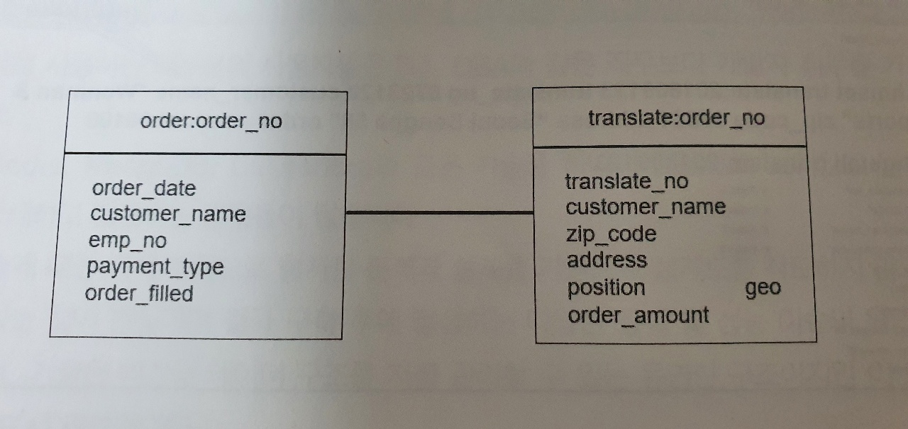
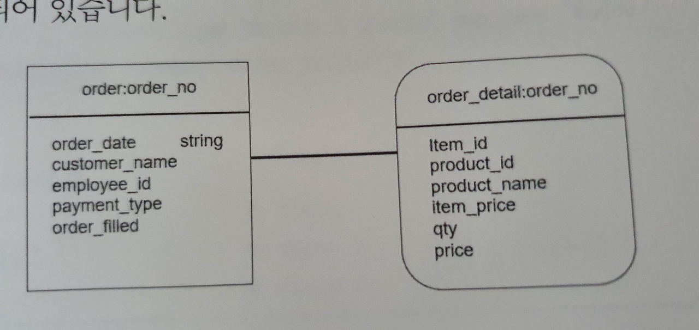
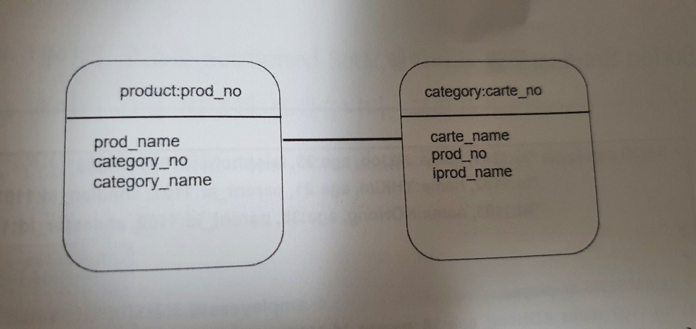
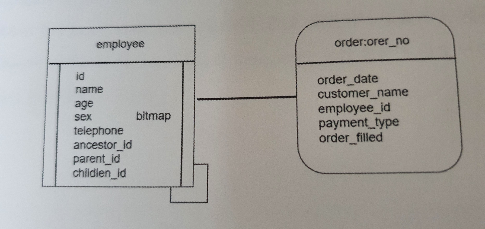

# 04. Redis Data Modeling

4장에서는 Redis의 논리적 구조와 용어에 대해서 알아본다.

## 4.1 키-밸류(KeyValue) 데이터 모델링 개념

### 4.1.1 용어 설명

|     RDBMS        |      Redis        |
|:-------------:	|:--------------:	|
|     Table        |      Table        |
|     Column        | Field(Element)    |
|  Primary Key    |       Key        |
|  Foreign Key    |      Link        |
| Not Null Null    |        X        |
|     Check        |  HyperLogLogs    |
|     Unique        |        X        |

관게형 DB에서 데이터를 저장하는 논리적 구조를 테이블(Table)이라고 표현하는 것처럼 키밸류 DB에서도 테이블이라고 한다.
그리고 하나의 테이블을 구성하고 있는 요소들을 컬럼(Column)이라고 하는데 키밸류 DB엣는 필드(Field)또는 엘리멘트(Element)라고 한다.

하나의 관계형 테이블은 반드시 하나의 식별키(Primary Key)와 컬럼들고 구성되는 것처럼 키밸류 DB도 하나의 Key아 하나 이상의 필드 또는 엘리멘트로 구성된다.
그러나, 키밸류 DB는 NOT Null, Unique와 같은 제약조건 기능을 제공하지 않는다.

### 4.1.2 Redis 데이터 모델링 가이드라인

Redis DB를 처음 접하는 경우 데이터 모델을 이해하는 것이 쉬운 일이 아니므로 대부분의 사용자들에게 익숙한 관계형 DB의 설계 패턴과 Redis의 설계 패턴을 매핑시켜 설명한다.

- Hash 데이터 모델
  - 관계형 DB의 데이터 모델 중 부모-자식(Parent-Child) 테이블 모델과 유사하다.
  - ex) 주문 - 배달 (배달은 주문이 존재해야만 존재할 수 있다.)
- List 데이터 모델
  - 관계형 DB의 마스터-디테일(Master-Detail) 테이블 모델과 유사하다.
  - 
  - 주문전표를 정규화 과정을 거치면 주문공통 테이블과 주문상세 테이블로 설계할 수 있다.
  - 하나의 주문전표에서 Master 테이블은 주문 상세 테이블에 대한 공통정보를 저장하기 위한 데이터 구조이고,
  - Detail 테이블은 각 항목번호에 대한 상세 정보를 저장하는 데이터 구조이다.
  - 이와 같은 데이터 관계를 Redis DB에서 구현할 때는 Hash-List 모델을 선택한다.
- Set/Sorted Set 데이터 모델
  - 관계형 DB의 계층형(Tree Structure) 데이터 모델과 유사하다.
- HyperLogLogs 데이터 모델
  - 관계형 DB의 Check-제약조건 데이터 모델과 유사하다.
  - 일반적으로 관계형 테이블의 특정 컬럼에 제한된 값 만을 저장해야 하는 경우에 다음과 같은 방법을 통해 구현할 수 있다.
    - 애플리케이션에서 조건을 확인하는 방법
    - 테이블을 생성할 때, 특정 컬럼에 Check 제약조건을 설정하는 방법
  - 이와 같은 데이터 관계를 Redis DB에서 구현할 때 HyperLogLogs 모델을 선택한다.

### 4.1.3 데이터 모델

Redis 데이터 모델링 가이드라인을 바탕으로 Redis DB에서 설계 가능한 데이터 모델 유형들과 실제 구현 방법에 대해서 정리해보자.
Redis 서버에서 설계할 수 있는 데이터 모델 유형은 크게 5가지가 있다.

1. Hash-Hash Data Model
2. Hash-List Data Model
3. List-List Data Model
4. Set/Sorted Set-List Data Model
5. HyperLogLogs Data Model

#### Hash-Hash 모델

주문 테이블과 배달 테이블은 대표적인 Hash-Hash 테이블로 설계될 수 있는 테이블 구조이다.


```shell
localhost:6379> flushall
OK
localhost:6379> hmset order:12345 customer_name "jongmin" emp_no "123" total 601100 payment_type "Credit" order_filled "Y"
OK

localhost:6379> hgetall order:12345
 1) "customer_name"
 2) "jongmin"
 3) "emp_no"
 4) "123"
 5) "total"
 6) "601100"
 7) "payment_type"
 8) "Credit"
 9) "order_filled"
10) "Y"

localhost:6379> hmset translate:12345 translate_no "45678" customer_name "jongmin" zip_code "15881" address "Seoul" order_amount 60100
OK

localhost:6379> hgetall translate:12345
 1) "translate_no"
 2) "45678"
 3) "customer_name"
 4) "jongmin"
 5) "zip_code"
 6) "15881"
 7) "address"
 8) "Seoul"
 9) "order_amount"
10) "60100"
```

#### Hash-List 모델

주문공통 테이블과 주문상세 테이블은 대표적인 Hash-List 데이터 모델로 설계될 수 있는 테이블이다.


```shell
localhost:6379> flushall
OK

localhost:6379> hmset order:12345 customer_name "jongmin" emp_no "123" total 601100 payment_type "Credit" order_filled "Y"
OK

localhost:6379> hgetall order:12345
 1) "customer_name"
 2) "jongmin"
 3) "emp_no"
 4) "123"
 5) "total"
 6) "601100"
 7) "payment_type"
 8) "Credit"
 9) "order_filled"
10) "Y"

localhost:6379> lpush order_detail:12345 "<item_id>1</item_id><item_price>10000</item_price><product_id>1</product_id><product_name>책</product_name><qty>1</qty><price>10000</price>"
(integer) 1

localhost:6379> lpush order_detail:12345 "<item_id>1</item_id><item_price>10000</item_price><product_id>1</product_id><product_name>책</product_name><qty>2</qty><price>20000</price>"
(integer) 2

localhost:6379> lrange order_detail:12345 0 1
1) "<item_id>1</item_id><item_price>10000</item_price><product_id>1</product_id><product_name>\xec\xb1\x85</product_name><qty>2</qty><price>20000</price>"
2) "<item_id>1</item_id><item_price>10000</item_price><product_id>1</product_id><product_name>\xec\xb1\x85</product_name><qty>1</qty><price>10000</price>"
```

#### List-List 모델

제품 테이블과 카테고리 테이블은 대표적인 List-List 데이터 구조로 설계될 수 있는 테이블이다. 이 데이터 구조는 M:N 관계 구조로 표현할 수 있다.



```shell
localhost:6379> flushall
OK
localhost:6379> lpush product:p1001 "{ pname : 'Asus M50', cname : { [ cname1 : c1001, cname2 : c1002, cname3 : c1003 ] } }"
(integer) 1

localhost:6379> lrange product:p1001 0 -1
1) "{ pname : 'Asus M50', cname : { [ cname1 : c1001, cname2 : c1002, cname3 : c1003 ] } }"

localhost:6379> lpush category:c1001 " { cname : 'Tablet', pname : { [ pname1 : p1001, pname2 : p1002 ] } }"
(integer) 1

localhost:6379> lrange category:c1001 0 -1
1) " { cname : 'Tablet', pname : { [ pname1 : p1001, pname2 : p1002 ] } }"
```

#### Set-Sorted Set-List 모델

관계형 DB는 하나의 테이블과 관계되는 상대 테이블을 식별키(Primary-Key)와 외부키(Foregin-Key)로 표현할 수 있으며 이를 통해 데이터 무결성을 보장할 수 있는 데이터 구조로 설계할 수 있다.  
이 때, 하나의 테이블과 관계되는 상대 테이블이 자기 자신이 될 수도 있는 데이터 구조를 계층 구조(Tree Structure) 테이블이라고 표현한다. Redis DB에서도 이와 같은 데이터 구조를 설계할 수 있는데 이를 Set/Sorted Set 테이블이라고 한다.



왼쪽 도형 내의 ancestor_id, parent_id, child_id 필드는 같은 도형 내의 id 필드 값을 참조한다.

```shell
localhost:6379> flushall
OK

localhost:6379> sadd employee "id:1101, name:JMJoo, age:25, telephone:01012341234"
(integer) 1

localhost:6379> sadd employee "id:1102, name: YHKim, age:21, parent_id:1101, child_id:1103"
(integer) 1

localhost:6379> sadd employee "id:1103, name:KOHong, age:38, parent_id:1102, ancestor_id:1101"
(integer) 1

localhost:6379> smembers employee
1) "id:1103, name:KOHong, age:38, parent_id:1102, ancestor_id:1101"
2) "id:1102, name: YHKim, age:21, parent_id:1101, child_id:1103"
3) "id:1101, name:JMJoo, age:25, telephone:01012341234"
```

## 4.2 논리적 DB 설계

하나의 Redis 서버는 여러 개의 데이터베이스로 구성된다. 기본적으로 논리적 데이터 베이스 16개를 생성할 수 있는데 필요에 따라 더 많은 수의 데이터베이스를 생성할 수도 있다. 여러 개의 데이터베이스를 설계 및 생성해야 하는 이유는 다음과 같다.

- 사용자가 생성하는 수십~수백개의 테이블은 데이터 성격, 비즈니스 룰, 관리 방안, 성능 이슈에 따라 여러 개의 논리적 DB에 분산 저장하는 것이 원칙이다.
  - 이와 같은 분산 저장 기술을 스트라이핑(Striping) 기법이라고 하며 가장 보편적인 설계 및 저장 기술이다.
- 하나의 데이터베이스에 모든 테이블과 인덱스를 생성 관리하면 예상하지 못한 장애가 발생할 수 있다.
  - 장애 범위 파악 및 복구가 어려울 수 있다. 
- 데이터베이스 기술은 데이터를 입력, 수정, 삭제, 조회할 때 발생하는 다양한 락(Lock) 현상으로 인해 성능 이슈가 발생할 수 있다.
  - 이를 최소화하기 위해서는 논리적으로 여러 개의 데이터베이스로 분산 설계하고 구축하는 것이 좋다.

이를 구현하는 방법은 CONF 환경설정 파일의 database 파라미터를 통해 개수를 결정하고 redis cli에서 select 문으로 해당 데이터베이스로 이동할 수 있다.
