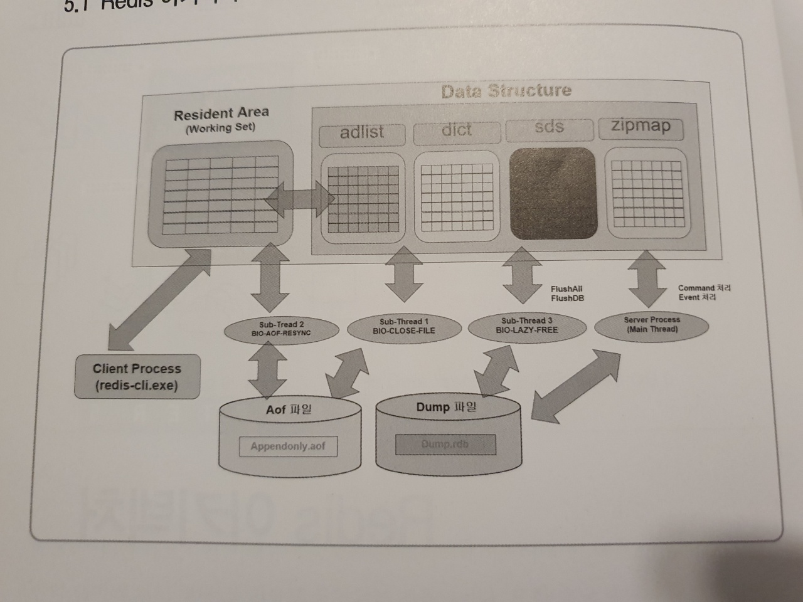

# 05. Redis 아키텍처

## 5.1 Redis 아키텍처



Redis 서버의 기본 아키텍처는 3가지 영역으로 구성되어 있다.

1. 메모리 영역
    - Resident Area: 사용자가 Redis 서버에 접속해서 처리하는 모든 데이터가 가장 먼저 저장되는 영역이며 실제 작업이 수행되는 공간이고 WorkingSet 영역이라고 표현한다.
    - Data Structure: Redis 서버를 운영하다 보면 발생하는 다양한 정보와 서버 상태를 모니터링하기 위해 수집한 상태 정보를 저장하고 관리하기 위한 메모리 공간이 필요하다. 이를 저장하는 메모리 영역을 Data Structure 영역이라고 한다.
2. 파일 영역
    - AOF 파일: Redis는 모든 데이터를 메모리 상에 저장하고 관리하는 인-메모리(InMemory) 기반의 데이터 처리 기술을 제공한다. 하지만 중요한 데이터의 경우 사용자의 필요에 따라 지속적으로 저장해야할 필요가 있는데 이를 위해 제공되는 디스크 영역이 AOF 파일이다. (스냅샷 데이터)
    - DUMP 파일: AOF 파일과 같이 사용자 데이터를 디스크 상에 저장할 수 있지만 소량의 데이터를 일시적으로 저장할 때 사용되는 파일이다.
3. 프로세스 영역
    - Server Process: redis-server.exe 또는 redis-sentinel.exe 실행 코드에 의해 활성화되는 프로세스를 서버 프로세스라고 하며, **Redis 인스턴스를
      관리해 주며 사용자가 요구한 작업을 수행하는 프로세스이다. Redis Server 프로세스는 4개의 멀티 스레드로 구성되는데 main thread, sub thread 1,2,3이 있다.**
    - Client Process: redis-cli.exe 또는 사용자 애플리케이션에 의해 실행되는 명령어를 실행하기 위해 제공되는 프로세스이다.

위는 Redis 기본 구조에 대한 설명이며 분산/복제가 가능한 클러스터 환경에서는 추가적인 프로세스 유형이 요구될 수 있다.

메모리 영역에 대해 실습을 통해 확인해보자.

```bash
localhost:6379> info memory
# Memory
used_memory:871864                  -> 현재 할당된 Redis 서버 크기
used_memory_human:851.43K           -> 사용자가 사용 중인 Redis 메모리 크기
used_memory_rss:5906432
used_memory_rss_human:5.63M
used_memory_peak:931696             -> Redis에게 할당되었던 최대 메모리 크기
used_memory_peak_human:909.86K
used_memory_peak_perc:93.58%
used_memory_overhead:830376         -> 사용자 메모리 크기에 대한 overhead
used_memory_startup:809880          -> 최초 할당되었던 Redis 메모리 크기
used_memory_dataset:41488           -> 사용자 데이터가 저장된 메모리 크기
used_memory_dataset_perc:66.93%
allocator_allocated:1054784
allocator_active:1273856
allocator_resident:4239360
total_system_memory:10447060992     -> 시스템 메모리 총 크기
total_system_memory_human:9.73G     -> 사용자가 사용 가능한 메모리 크기
used_memory_lua:37888
used_memory_lua_human:37.00K
used_memory_scripts:0
used_memory_scripts_human:0B
number_of_cached_scripts:0
maxmemory:0                         -> maxmemory 파라메터에 설정된 메모리 크기
maxmemory_human:0B                  -> 사용자가 실제 사용 가능한 Redis 크기
maxmemory_policy:noeviction
allocator_frag_ratio:1.21
allocator_frag_bytes:219072
allocator_rss_ratio:3.33
allocator_rss_bytes:2965504
rss_overhead_ratio:1.39
rss_overhead_bytes:1667072
mem_fragmentation_ratio:7.11        -> 메모리의 단편화 상태율
mem_fragmentation_bytes:5075592
mem_not_counted_for_evict:0
mem_replication_backlog:0
mem_clients_slaves:0
mem_clients_normal:20496
mem_aof_buffer:0
mem_allocator:jemalloc-5.1.0
active_defrag_running:0
lazyfree_pending_objects:0
lazyfreed_objects:0
```

Redis의 메모리 영역에 대한 HIT과 MESSES는 다음과 같이 확인한다.
```bash
localhost:6379> info stats
# Stats
total_connections_received:2
total_commands_processed:5
instantaneous_ops_per_sec:0
total_net_input_bytes:127
total_net_output_bytes:41781
instantaneous_input_kbps:0.00
instantaneous_output_kbps:0.00
rejected_connections:0
sync_full:0
sync_partial_ok:0
sync_partial_err:0
expired_keys:0
expired_stale_perc:0.00
expired_time_cap_reached_count:0
expire_cycle_cpu_milliseconds:12
evicted_keys:0
keyspace_hits:0                    -> 메모리로부터 동일한 데이터가 발견된 경우 hits 증가
keyspace_misses:0                  -> 동일한 데이터를 발견하지 못한 경우 misses 증가
pubsub_channels:0
pubsub_patterns:0
latest_fork_usec:0
total_forks:0
migrate_cached_sockets:0
slave_expires_tracked_keys:0
active_defrag_hits:0
active_defrag_misses:0
active_defrag_key_hits:0
active_defrag_key_misses:0
tracking_total_keys:0
tracking_total_items:0
tracking_total_prefixes:0
unexpected_error_replies:0
total_error_replies:0
dump_payload_sanitizations:0
total_reads_processed:7
total_writes_processed:5
io_threaded_reads_processed:0
io_threaded_writes_processed:0
```

## 5.2 시스템 & Disk 사양


서버의 하드웨어 사양을 어떻게 결정할 때는 비즈니스 영역에 맞는 최적화된 사양을 선택하는 것이 좋겠지만 이는 너무 추상적인 설명이므로 Redis 기본 구조와 기술의 주요 특징을 반영하여 항목별로 이야기해보자.

### 5.2.1 노트 수 (# of nodes per cluster)

하나의 Standalone 서버를 구축하는 경우에는 마스터(Master) 서버 1대, 슬레이브(Slace) 서버 1대 그리고 FailOver와 Load-Balancing을 위한 센티널(Sentinel) 서버 1대로 구성하는 경우 최소 3대의 서버가 요구된다.
여기서 마스터 서버와 슬레이브 서버는 실제 데이터를 저장하는 서버이기 때문에 최적화된 서버 사양이어야 하지만 센티널 서버는 사용자 데이터를 저장하지 않기 때문에 최소 사양으로 구성해야 한다. 한가지 더 고려해야할 점은 마스터 1대와 슬레이브 1대는 이중 복제이기 때문에 크리티컬한 비즈니스 환경에서는 필요에 따라 삼중 복제 시스템이 요구될 수도 있다.

**결론적으로 Standalone 또는 Cluster 서버를 구축하는 경우 하나의 복제 시스템 구축을 위해 요구되는 최소 서버 대수는 마스터 서버 1대, 슬레이브 서버 1대, 센티널 서버 1대로 구성되어야 한다.**

### 5.2.2 CPU Core 수 (# of cores per node)

각 서버당 CPU Core 수에 대한 설명이다. Redis 또는 MongoDB와 같은 NoSQL은 빅데이터 플랫폼을 기반으로 개발된 SWemf이다. 여기서 예상해 볼 수 있는 것은 수 많은 세션에서 초당 10만건~20만건 이상의 데이터를 빠르게 쓰기/읽기 작업을 수행하는 비즈니스 환경을 생각해볼 수 있다. **일반적으로는 CPU Core 수가 몇 개 이상이어야 한다는 정답은 없지만 최근에 판매되고 있는 서버들의 최소 사양이 4 Core인 것을 감안한다면 Redis 서버 구축을 위한 최소 Core 수에 대한 가이드라인은 다음과 같이 정리해볼 수 있다.**

- Small 비즈니스 환경: 4 Core 이하
- Medium 비즈니스 환경: 4 Core ~ 8 Core 이하
- Big 비즈니스 환경: 8 Core ~ 16 Core 이상

### 5.2.3 RAM 크기

Redis 서버를 위한 최소 권장 사양안 14~15GB이다. 가끔 하나의 서버에 웹서버 등과 같은 SW를 함께 설치하여 사용하는 경우들이 있는데 이와 같은 시스템 운영은 바람직하지 않다. **RAM 크기는 사용자 세션 수, 처리하는 데이터 양, 처리 방법(배치, 실시간), 초당 데이터 발생량에 의해 결정되어야 한다.** RAM 크기를 결정할 수 있는 비즈니스 여건들에 대한 사전 수집 및 분석 결과가 없는 상태에서 제안할 수 있는 가이드라인은 다음과 같다.

- Small 비즈니스 환경: 16 GB 이하
- Medium 비즈니스 환경: 32 Core ~ 64 Core 이하
- Big 비즈니스 환경: 64 Core ~ 128 Core 이상

### 5.2.4 스토리지(Storage) 타입

빅데이터 플랫폼 환경은 어떤 환경보다 많은 데이터를 빠른 시간 내에 처리해야 하는 것이 목표이기 때문에 SSD 타입의 저장장치 사용을 적극 권장한다. 하지만 Redis 서버의 아키텍처는 인 메모리 기반이므로 스토리지 장치에 과도한 비중을 둘 필요는 없다.

### 5.2.5 스토리지 크기(Persistent Storage)

Redis 서버를 구축할 때 요구되는 하드웨어 사양에서 중요한 항목 중 하나는 스토리지 크기에 대한 고려이다. **스토리지 크기는 Redis 서버에서 처리하려는 초당 발생량, 저장 보관 빈도(년, 월, 일), 저장해야 할 총 데이터양 등을 조사 분석하여 결정해야 한다.**

- 최소 스토리지 크기 = 사용자 데이터의 총 크기 + (RAM 크기 * 3)
- 권장 스토리지 크기 = 사용자 데이터의 총 크기 + (RAM 크기 * 6)

### 5.2.6 네트워크

NoSQL 또는 Redis와 같은 빅데이터 처리 플랫폼은 스케일-아웃을 기반으로 하는 분산, 복제 시스템이 기본 구성이다. 스케일-업을 기반으로 하는 경우에 비해 무엇보다 네트워크 환경은 시스템 성능을 결정하는 중요한 요소 중에 하나가 될 수밖에 없다. Redis 서버를 운영하기 위해 요구되는 최소 네트워크 환경은 1G 환경이며 적정 권장 환경은 10G 이상이다.

## 5.3 매모리 운영기법

> Redis는 In-Memory DB에서 제공하는 최적의 성능 보장을 위해 메모리 영역을 효율적으로 운영 관리할 수 있는 LRU(Latest Recently Used) 알고리즘과 LFU(Latest Frequently Used) 알고리즘을 제공한다.

인-메모리 기반은 모든 데이터를 메모리 상에만 저장하기 때문에 디스크 저장 장치에는 어떤 데이터도 저장하지 않으므로 파일 시스템에 비해 상대적으로 디스크 IO가 발생하지 않기 때문에 빠른 성능을 기대할 수 있다. 하지만 Redis 서버도 사용자의 필요에 따라 중요 데이터를 디스크 저장 장치에 DUMP, AOF 형태로 저장할 수 있다. (하지만 파일 시스템 기반의 저장 관리 메커니즘과는 기본 작동 방식이 많이 다르기 때문에 파일 시스템 기반이라는 표현을 하지 않는다.)

**Redis 서버는 인-메모리 기반의 데이터 저장 관리 기술을 제공하지만 시스템 메모리 크기는 제한적일 수 밖에 없고 상대적으로 사용자 데이터는 이보다 훨씬 더 클 수밖에 없기 때문에 모든 데이터를 100% 메모리에서 저장 관리할 수는 없다. 이와 같은 문제점을 개선하기 위해 Redis 서버는 4.0 버전부터 `LRU 알고리즘`과 `LFU 알고리즘`을 제공한다.**

### 5.3.1 LRU(Latest Recently Used) 알고리즘

LRU는 가장 최근에 처리된 데이터들을 메모리 영역에 최대한 재 배치시키는 알고리즘이다. 최근 사용된 데이터들이 최대한 메모리 상에 존재할 수 있도록 운영하는 것이다. (재 사용될 가능성이 높기 때문에)

LRU 알고리즘으로 Redis 서버 인스턴스를 운영하기 위해서는 `redis.conf` 파일에 다음과 같이 관련 파라메터를 설정해야 한다.

```bash
$ vi redis.conf

Maxmemory            3000000000      -> Redis 인스턴스를 위한 총 메모리 크기
maxmemory-sample     5               -> LRU 알고리즘에 의한 메모리 운영
```

### 5.3.2 LFU(Latest Frequently Used) 알고리즘

**LRU의 최대 단점은 최근에 사용된 데이터라고 항상 재사용이되는 것은 아니다 라는 것이다. 그 중에 자주 참조되는 데이터만 배치하고 그렇지 않은 데이터들은 메모리로부터 제거하여 자주 참조되는 데이터들이 배치될 수 있도록 운영하는 방법을 LFU 알고리즘이라고 한다.**

LFU 알고리즘으로 Redis 서버 인스턴스를 운영하기 위해서는 `redis.conf` 파일에 다음과 같이 관련 파라메터를 설정해야 한다.

```bash
$ vi redis.conf

lfu-log-factor     10          -> LFU 알고리즘에 의한 메모리 운영(Default 10)
lfu-decay-time     1
```

### 5.4 LazyFree 파라메터

인-메모리 기반의 데이터 저장 구조인 Redis에서 메모리 영역에 대한 효율적인 운영과 관리는 성능에 직접적인 영향을 미치기 때문에 매우 종요한 성능 포인트 중에 하나이다. 특히 초당 수만~수십 만 건의 데이터가 저장되는 빅데이터 환경은 빠른 시간 내에 **Redis 인스턴스에게 할당된 메모리 영역이 최대 임계치에 도달하게 되는데 이 경우, 연속적인 범위 키(Key) 값이 동시에 삭제되는 오퍼레이션이 실행되면 메모리 부족과 프로세스의 지연처리로 인해 성능 지연문제가 발생하게 된다.**

이와 같은 성능 문제를 해소할 수 있는 방법은 Redis 인스턴스를 위한 메모리 영역의 크기를 충분히 할당하는 것과 더불어 LazyFree 파라메터를 설정해 주는 것이다. **LazyFree 파라메터는 별도의 백그라운드 스레드를 통해 입력과 삭제 작업이 지연되지 않고 연속적으로 수행될 수 있도록 해준다. LazyFree 스레드는 앞에서 이야기한 Redis 아키텍처에서 소개했던 프로세스 영역의 4개의 스레드 중에 하나이다.**

```bash
$ vi redis.conf

lazyfree-lazy-eviction        no        -> yes 권장 (unlink로 삭제하고 새 키 저장)
lazyfree-lazy-expire          no        -> yes 권장 (unlink로 만기 된 키 삭제)
lazyfree-lazy-server-del      no        -> yes 권장 (unlink로 데이터 변경)
slave-lazy-flush              no        -> yes 권장 (복제 서버가 삭제 된 후 복제할 때 FlushAll async 명령어로 삭제)
```

#### 5.4.1 lazyfree-lazy-eviction


#### 5.4.2 lazyfree-lazy-expire

#### 5.4.3 lazyfree-lazy-server-del

#### 5.4.4 slave-lazy-flush


