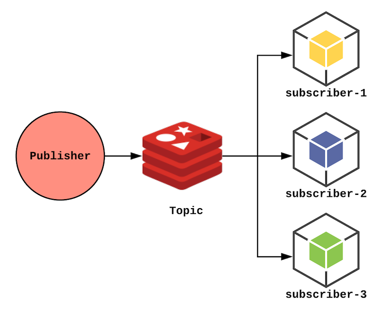
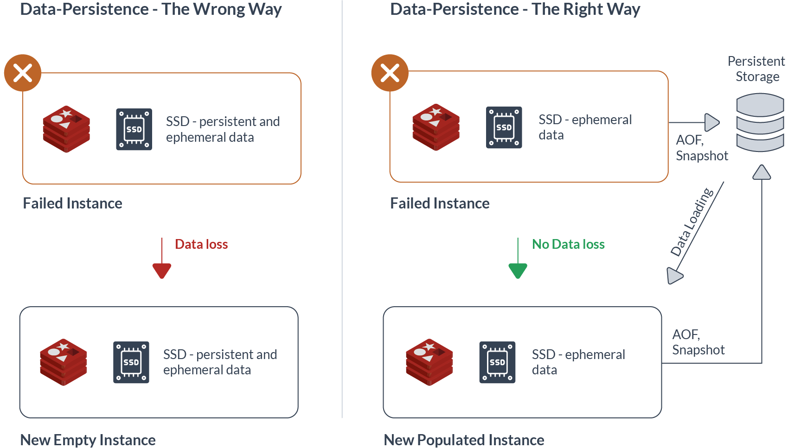
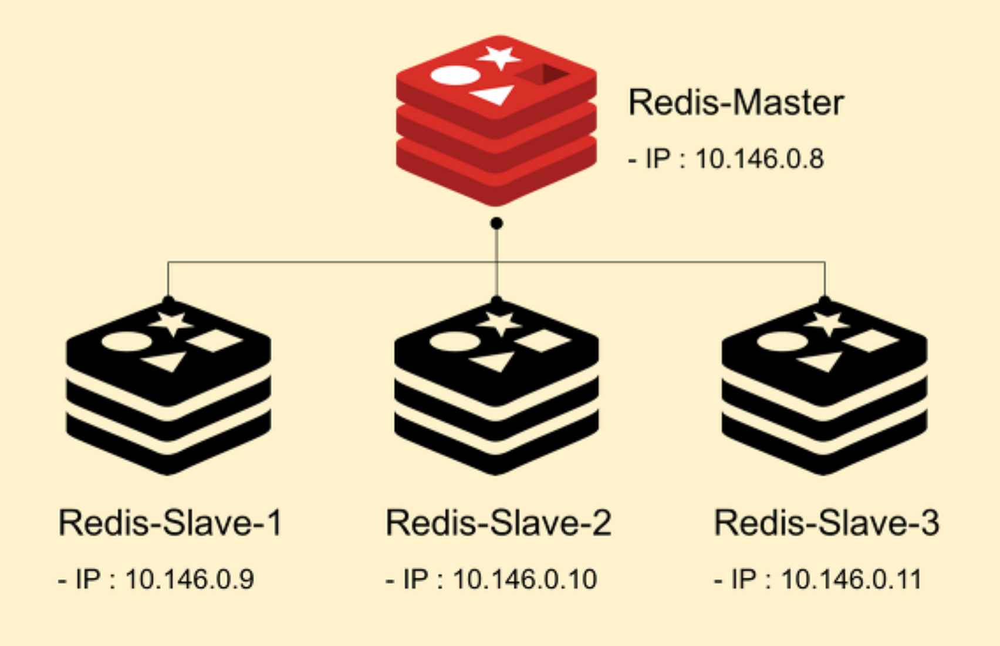
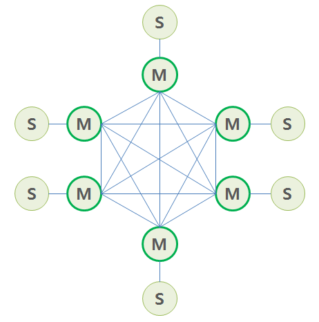

# Redis

레디스는 오픈소스, 인 메모리 **데이터 저장소**입니다. 데이터베이스, 캐시, 또는 메시지 브로커처럼 사용됩니다. 

최근에 회자되고 있는 대규모 서비스를 운영하는 업체(인스타그램, 트위터, 핀터레스트, 네이버, 카카오 등)의 엔지니어링 블로그를 살펴보면, 공통으로 자주 등장하는 기술들이 있다. 키워드를 뽑아보면 NoSQL, Cache, Redis, Memcache, Sharding 등 모두 대용량 데이터 처리 관련 기술이다.

즉, 대규모 서비스를 운영하는 업체는 항상 데이터의 안정적인 저장과 빠른 처리를 원하는데, 이를 위해 위의 키워드와 관련된 기술들이 필요하다. 이를 위해 위의 키워드와 관련된 기술들이 필요하다. Redis를 누군가는 속도를 빠르게 하기 위한 Cache 솔루션이라고 정의하고, 어떤 사람은 NoSQL의 Key-Value 스토어로 분류하기도 한다.


## 주요 특성

| 항목                                | 내용                                                         |
| ----------------------------------- | ------------------------------------------------------------ |
| Key-Value 스토어                    | 단순 스트링에 대한 Key/Value(키/벨류) 구조를 지원한다.       |
| 다양한 자료 구조 지원               | List, Set, Sorted Set, Hash 등의 자료 구조를 지원한다.       |
| Pub/Sub 지원                        | Publish/Subscribe 모델을 지원한다.                           |
| 디스크 저장<br />(Persistent Layer) | 메모리 상태를 디스크로 저장할 수 있는 기능과 현재까지의 업데이트 관련 명령을 저장할 수 있는 AOF 기능이 있다. |
| 복제<br />(Replication)             | 다른 노드에서 해당 내용을 복제할 수 있는 마스터/슬레이브 구조를 지원한다. |
| 만료 시간 지정                      | key별로 TTL(Time-To-Live)을 정해두면 레디스가 알아서 해당 시점이 지날때 key 삭제한다. |
| 트랜잭션 처리                       |                                                              |
| 빠른 속도                           | 이상의 기능을 지원하면서도 초당 100,000QPS(Queries Per Second) 수준의 높은 성능을 자랑한다. |


### Key-Value 스토어

기본적으로 Redis는 Key-Value 형태의 데이터 저장소다. 그래서 다음과 같이 간단한 명령을 이용해 데이터를 저장할 수 있다.

```
redis> set id:username "username"
OK
redis> set id:email test@test.com
OK
redis> get id:username
username
```


### 다양한 자료 구조 지원


Redis는 일반 Key-Value 스토어가 아니라 실제로 다양한 종류의 자료형을 지원한다. 기존의 Key-Value 스토어에서는 문자열 키를 문자열 값에 연결하는 반면 Redis에서는 값이 단순한 문자열에 국한되지 않고 더 복잡한 데이터 구조도 저장할 수 있다. 

Redis에서 지원하는 모든 자료형의 목록

- binary-safe string
- list
- set
- sorted set
- hash
- bit array
- hyperloglog
- stream

> **❓ binary-safe 란?**
>
> `$str_len\r\nbinary_safe_string\r\n` 가 Redis에서 표현하는 binary-safe string의 예입니다. 
>
> 문자열의 길이와 종료 문자가 이미 문자열 표현에 포함되어 있기 때문에 binary-safe string 부분에는 문자열이기만 하면 (예를 들어 JPEG 이미지) 저장할 수 있습니다. 즉 binary-safe string이라고 하면, 모든 문자(byte)로 구성될 수 있는 문자열을 뜻합니다. Reids에서는 이런 특성 때문에 문자열이기만 하면 최대 512MB 까지 저장할 수 있습니다.


### Pub/Sub 지원



Redis는 Pub/Sub 기능을 지원한다. 서버 간에 통지가 필요할 때, 이 기능이 매우 유용하다.


### 디스크 저장(Persistent Layer)



Redis의 가장 큰 특징 중 하나는 현재의 메모리 상태를 디스크에 저장할 수 있다는 것이다. Redis에는 현재 메모리 상태의 스냅샷을 남기는 `RDB 기능` 과 지금까지 실행된 업데이트 관련 명령어 집합인 `AOF` 가 있다.

다만, 여기엔 주의해야할 점이 있다. 스냅샷을 남기는 기능의 이름이 `RDB` 이다보니 데이터베이스라고 생각해서 데이터베이스의 모든 기능 역시 지원되지 않을까 기대하는 것은 금물이다. 이렇게 덤프한 내용은 다시 메모리에 올려서 사용할 수 있다.

AOF는 `Append Only File` 의 약어로, set/del 등의 업데이트 관련 명령을 받으면 해당 명령어를 그대로 기록해둔다. 


### 복제(Replication)



Redis는 마스터/슬레이브 리플리케이션을 지원한다. 이를 통해 마스터에 장애가 발생하면 슬레이브로 서비스하거나 마스터의 부하가 많을 때에는 슬레이브를 이용해서 읽기를 처리할 수도 있다. 대규모 서비스에서 Redis 저장소로 안정적으로 사용하려면 복제 기능을 반드시 이용해야한다.


### 트랜잭션 처리

Redis 에서 `MULTI, EXEC, DISCARD, WATCH` 는 Transaction 의 기반이 되는 Command 들이다. 이들은 한 단계로 Command 들을 그룹 단위로 실행할 수 있으며, 두 가지의 중요한 점들을 보장한다:

1. Transaction 에서 모든 Command 들은 순차화되어 순서대로 실행된다. 다른 사용자의 요청은 기존에 실행되고 있던 Redis transaction 중간에 실행될 수 없다. 즉, Redis 에서 Transaction 은 단일 isolated 작업으로써 실행된다는 점이 보장된다.
2. Redis transaction 은 모든 Command 들을 처리 또는 수행하지 않음으로써 Atomic 을 보장한다.


#### atomic operation

레디스는 다음과 같은 원자적 연산을 지원합니다.

- [appending to a string](https://redis.io/commands/append)
- [incrementing the value in a hash](https://redis.io/commands/hincrby)
- [pushing an element to a list](https://redis.io/commands/lpush)
- [computing set intersection](https://redis.io/commands/sinter)
- [union](https://redis.io/commands/sunion)
- [difference](https://redis.io/commands/sdiff)
- [getting the member with highest ranking in a sorted set](https://redis.io/commands/zrangebyscore).


## Redis 운영 모드

### Single Thread

Redis는 싱글 스레드이기 때문에, 태생적으로 하나의 명령이 오랜 시간을 소모하는 작업에는 적합하지 않다. 그런데 이러한 특성을 이해하지 못하는 경우 장애가 발생하게 된다. 즉, 싱글 스레드이기 때문에 시간이 오래 걸리는 Redis 명령을 호출하면, 명령을 처리하는 동안에는 Redis가 다른 클라이언트의 요청을 처리할 수 없다.

> ⚠️ Redis Multi Thread
>
> Redis 4.0 부터는 기본적으로 4개의 쓰레드로 동작하지만 일반 명령어를 처리하는 `메인쓰레드 1개`와 별도의 시스템 명령들을 사용하는 전용 `sub trhead 3개` 로써, 실제로 사용자가 사용하는 명령어들을 `싱글쓰레드`로 동작한다고 생각하면 된다.
>
> Redis 6.0부터 ThreadedIO가 추가되어 사용자 명령이 멀티쓰레드가 지원된다. 하지만 명령어를 실행하는 코어부분은 여전히 single thread로 동작하며, I/O Socket read/write를 할때 멀티쓰레드로 동작하여 전반적인 성능이 향상되었다. 


#### Redis 서버에서 Keys 명령을 사용하지 말자.

Redis 명령어 중 현재 서버에 저장된 key 목록을 볼 수 있는 keys 명령이 있다. 이 명령을 사용하면 원하는 패턴에 맞는 명령들만 얻어올 수도 있다. keys 명령의 사용법은 다음과 같다. (정규표현식 지원)

**전체 키 목록 가져오기**

```
redis> keys *
0 id_story:1:actorMotions
1 stats:dam:2021102017
2 id_story:1:illustrations
3 stats:dam:2021110310
4 groupId:1:story:1:places
5 stats:dam:2021110415
6 stats:dam:20210902
7 stats:dam:20210830
8 stats:dam:2021090611
9 id_story:4:actorMotions
```


**story가 포함된 key 목록을 가져오기**

```
redis> keys *story*
0 id_story:1:actorMotions
1 id_story:1:illustrations
2 groupId:1:story:1:places
3 id_story:4:actorMotions
```


이렇게만 보면 keys 명령이 굉장히 좋은 기능을 제공하는 듯하다. 하지만 실제 서비스에서 해당 명령을 사용하면 장애로 이어질 가능성이 높다. 

> **⚠️ 레디스 공식 문서에서도 실제 제품에서는 쓰지말라고 한다.**
>
> **Warning**: consider [KEYS](https://redis.io/commands/keys) as a command that should only be used in production environments with extreme care. It may ruin performance when it is executed against large databases. This command is intended for debugging and special operations, such as changing your keyspace layout. Don't use [KEYS](https://redis.io/commands/keys) in your regular application code. If you're looking for a way to find keys in a subset of your keyspace, consider using [SCAN](https://redis.io/commands/scan) or [sets](https://redis.io/topics/data-types#sets).


#### flushall/flushdb 명령을 주의하자.

Redis에는 모든 데이터를 삭제하는 flushall/flushdb 라는 명령이 있다. Redis는 db라는 가상의 공간을 분리할 수 있는 개념을 제공하고, select 명령으로 이동할 수 있다. 이를 통해 같은 Key라도 'db 0번', 'db 1번' 등, db 개수에 따라서 여러 개를 만들 수 있다. 이런 db 하나의 내용을 통째로 지우는 것이 flushdb, 모든 db 내용을 지우는 것이 flushall 명령이다.

이 명령을 지우는 속도가 O(n)이기 때문에 데이터 양에 영향을 받게 된다. Redis가 싱글 스레드이기 때문에 이런 작업을 피해야한다.


### Redis HA

레디스는 단일 인스턴스만으로도 충분히 운영이 가능하지만, 물리 머신이 가진 메모리의 한계를 초과하는 데이터를 저장하고 싶거나, failover에 대한 처리를 통해 HA를 보장하려면 센티넬이나 클러스터 등의 운영 모드를 선택해서 사용해야 한다. 


#### Redis Sentinel

- 운영환경에서 레디스는 일반적으로 마스터와 복제로 구성됩니다.  운영중 예기치 않게 마스터가 다운되었다면, 관리자가 이를 감지해서 복제를 마스터로 올리고 클라이언트들이 새로운 마스터에 접속할 수 있도록 해 주어야 합니다.  센티널은 마스터와 복제를 감시하고 있다가 마스터가 다운되면 이를 감지해서 관리자의 개입없이 자동으로 복제를 마스터로 올려줍니다.

- 센티널은 다음과 같은 기능을 합니다.

- - **모니터링 Monitoring** : 센티널은 레디스 마스터, 복제들을 제대로 동작하는지 지속적으로 감시합니다.
  - **자동 장애조치 Automatic Failover** : 센티널은 레디스 마스터가 예기치 않게 다운되었을 때 복제를 새로운 마스터로 승격시켜 줍니다.  그리고 복제가 여러 대 있을 경우 이 복제들이 새로운 마스터로 부터 데이터를 받을 수 있도록 재 구성하고, 다운된 마스터가 재 시작했을 때 복제로 전환되어 새로운 마스터를 바라볼 수 있도록 합니다.
  - **알림 Notification** : 센티널은 감시하고 있는 레디스 인스턴스들이 failover 되었을 때 Pub/Sub으로 Application(client)에게 알리거나 shell script로 관리자에게 이메일이나 SMS로 알릴 수 있습니다.


#### Redis Cluster



Redis Cluster는 여러 **Redis 서버에 데이터를 자동으로 sharding 해주는 기술**이다. Replication 구성을 한다면 Cluster 운영중에 노드중 일부가 장애를 겪고 있더라도 작업을 계속할 수 있게 해준다. (별도의 Replication 구성이 필요한 것은 아니다.)


### HA 구성 예시

#### 1. Standalone: No HA, 마스터

- 레디스 서버 1대로 구성한다. 이것을 마스터 노드라고 한다. 서버 다운 시 AOF 또는 RDB 파일을 이용해서 재시작한다.


#### 2. 이중화: Half HA, 마스터-슬레이브

- 레디스 서버 2대(마스터-슬레이브)로 구성한다. 슬레이브는 마스터의 데이터를 실시간으로 전달받아 보관한다.
- 마스터 다운 시 슬레이브 서버를 이용해서 서비스를 계속할 수 있다. 하지만 이때는 수동으로 슬레이브 서버를 마스터로 변경시켜야 하고, 애플리케이션이 새로운 마스터에 접속해서 서비스를 계속할 수 있도록 구현해야 한다. 그래서 Half HA라고 이름 붙혔다.
- 한 마스터에 슬레이브를 여러 대 구성할 수 있다. 슬레이브에 또 다른 슬레이브를 둘 수도 있다.


#### 3. 이중화 + Sentinel: HA, 무중단 서비스 가능

- 마스터-슬레이브 구성에 센티널을 추가해서 각 서버를 감시하도록 한다. 센티널은 마스터 서버를 감시하고 있다가 다운되면 슬레이브를 마스터로 승격시킨다. 레디스 클라이언트(애플레케이션)은 새로운 마스터로 접속해서 서비스를 계속한다.
- 다운되었던 마스터가 다시 시작하면 센티널이 슬레이브로 전환시킨다.
- 센티널은 데이터 처리는 하지 않는다.
- 일반적으로 센티널을 3대로 구성한다. 이것은 센티널 자체의 다운을 고려한 것이다.


#### 4. Redis Cluster: HA, 무중단 서비스 가능

- **샤딩:** 클러스터는 샤딩(sharding) 방법을 제공하는 것이다. 클러스터 마스터가 3대이면 데이터가 3대에 나누어 저장된다. 예를 들어, 100개의 데이터가 있다면 1번 마스터에 33개, 2번 마스터에 다른 33개, 3번 마스터에 나머지 34개가 저장되는 방식이다.
- **Hash 함수:** 데이터를 나누는 방식은 키에 hash 함수를 적용해서 값을 추출하고, 이 값을 각 마스터 서버에 할당한다. 예를 들어, 1~100까지 나오는 hash 함수가 있고, 클러스터 마스터 서버가 3대이면 1번 서버에 1~33까지, 2번 서버에 34~66까지, 3번 서버에 67~100까지 할당한다.  이것은 클러스터 구성 시에 각 마스터 서버에 할당된다.
- **16384 슬롯:** 레디스에서 hash 값의 개수는 16384(0~16383)이고 이것을 슬롯(slot)이라고 한다.
- **레디스 클라이언트:** 클라이언트는 서버와 동일한 hash 함수를 가지고 있으며, 마스터 서버에 접속해서 각 서버에 할당된 슬롯 정보를 가지고 있다.  키가 입력되면 hash 함수를 적용해서 어느 마스터에 저장할지 판단해서 해당 마스터에 저장한다.
- **데이터 서버 + 센티널:** 각 마스터 서버는 데이터의 처리와 센티널의 역할을 같이 수행한다. 예를 들어, 1번 마스터 서버가 다운되면 나머지 살아있는 마스터들 중에서 리더를 선출해서 리더가 1번 마스터의 슬레이브를 마스터로 승격시킨다.
- **최소 3대:** 마스터 서버는 최소 3대로 구성하고 각각은 슬레이브를 가질 수 있다.
- 마스터를 관리하는 마스터(master of master)는 없다. 마스터의 마스터가 있으면 단일 장애점(Single point of failure)가 된다.
- **샤딩(Sharding):** 대량의 데이터를 처리하기 위해 여러 개의 데이터베이스에 분할하는 기술이다. 즉 DBMS안에서 데이터를 나누는 것이 아니고 DBMS 밖에서 데이터를 나누는 방식이다. 그러므로 샤드 수에 따라 여러 대의 DBMS를 설치해야 한다.  레디스 클러스터는 샤딩방식이다.
- **파티셔닝(Partitioning):** 대량의 데이터를 처리하기 위해 DBMS 안에서 분할하는 방식이다. 즉 한 대의 DBMS만 설치하면 된다.
- 클러스터에 대한 자세한 내용은 [레디스 클러스터](http://redisgate.kr/redis/cluster/cluster.php) 참고


## 참고

- [redisgate](http://redisgate.kr/)

- [redis cluster sentinel overview](https://www.letmecompile.com/redis-cluster-sentinel-overview/)

- [[redis blog] diving into redis 6.0](https://redis.com/blog/diving-into-redis-6/)

- [redis transaction 번역](https://dark0096.github.io/redis/2018/10/27/redis-transaction.html)

  

